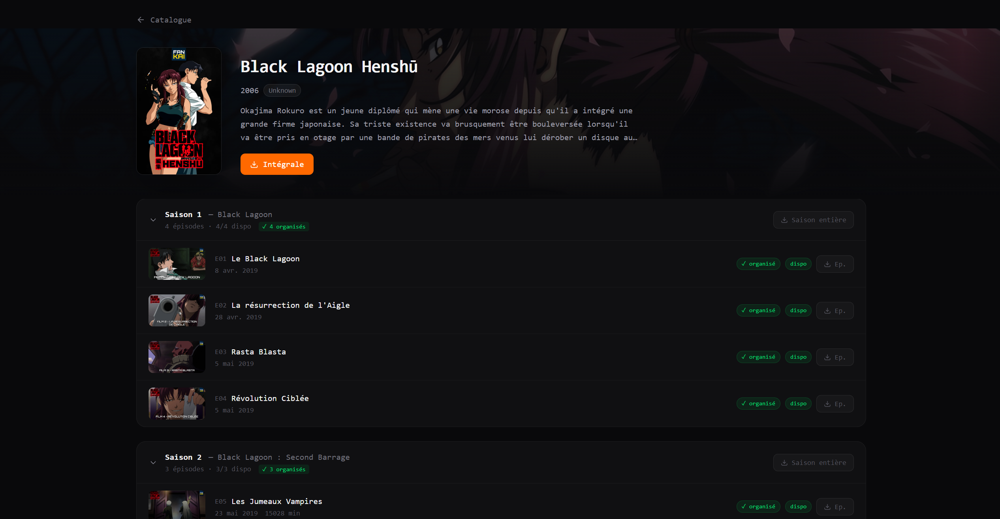
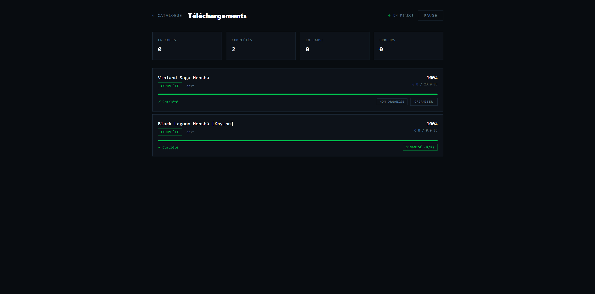
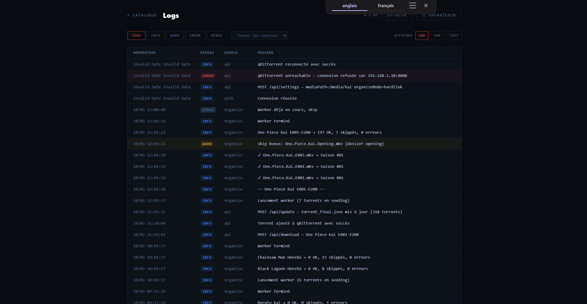

<div align="center">

# Fankarr


**Gestionnaire de téléchargements pour le catalogue [Fankai](https://fankai.fr)**  
Inspiré de Radarr/Sonarr — interface dédiée aux éditions Kai & Yabai

</div>

---


> Vue catalogue : toutes les séries Fankai avec leur état d'organisation. Les badges indiquent si les fichiers sont déjà présents dans votre médiathèque Jellyfin.

---

## Fonctionnalités

- **Catalogue complet** des séries Fankai avec affiches, statut et badges d'état
- **Téléchargement en un clic** vers qBittorrent — par épisode, par saison ou intégrale
- **Organisation automatique** des fichiers téléchargés vers votre médiathèque (hardlink ou déplacement)
- **Suivi par épisode** — badge ✓ organisé sur chaque épisode et compteur par saison
- **Notifications** toast automatiques quand une organisation se termine
- **Page téléchargements** avec statut d'organisation et badge erreurs avec détail au hover
- **Logs centralisés** avec filtre par niveau/source, rotation automatique et clear depuis l'UI
- **Multi-client torrent** — architecture extensible (qBittorrent supporté)
- **Authentification** par mot de passe avec session JWT
- **Compatible Runtipi / Docker**

---



> Vue série : détail des épisodes avec leur état de disponibilité torrent et d'organisation dans Jellyfin.

---



> Vue téléchargements : suivi en temps réel de l'organisation avec détail des erreurs au survol.

---



> Page logs : historique complet des événements avec filtres et gestion de la taille.

---

## Données torrent — Scraper

Les données du catalogue sont récupérées depuis le repo [`fankarr-scraper`](https://github.com/masutayunikon/fankarr-scraper).

Ce repo contient un pipeline de scripts Python qui collecte, parse et résout les torrents Fankai depuis les trackers publics, puis les croise avec l'API metadata de Fankai pour identifier chaque épisode. Les scripts tournent automatiquement **toutes les 6 heures** via GitHub Actions et publient le fichier `torrent_final.json` dans le repo.

Fankarr récupère ce fichier au démarrage et via le bouton **Mettre à jour** dans les paramètres. Aucun scraping ne se fait en local.

---

## Installation

### Prérequis

- Docker + Docker Compose
- qBittorrent accessible en réseau
- Un dossier de téléchargements complétés (`/downloads/complete` ou équivalent)
- Un dossier médiathèque pour Jellyfin (`/media/Kai` ou équivalent)

### Docker Compose

```yaml
services:
  fankarr:
    image: masutayunikon/fankarr:latest
    container_name: fankarr
    environment:
      - PUID=1000        # UID de votre utilisateur (id -u)
      - PGID=1000        # GID de votre utilisateur (id -g)
      - TZ=Europe/Paris  # Votre timezone
    volumes:
      - ./data:/app/data                        # Config, logs, base de données
      - /votre/chemin/media:/media/Kai          # Destination Jellyfin
      - /votre/chemin/complete:/downloads/complete  # Dossier complétés qBittorrent
    ports:
      - 3001:3001
    restart: unless-stopped
```

```bash
docker compose up -d
```

Fankarr sera accessible sur `http://localhost:3001`.

### Variables d'environnement

| Variable | Défaut | Description |
|---|---|---|
| `PUID` | `1000` | UID utilisateur pour les permissions fichiers |
| `PGID` | `1000` | GID utilisateur pour les permissions fichiers |
| `TZ` | — | Timezone (ex: `Europe/Paris`) |
| `JWT_SECRET` | auto-généré | Secret JWT — généré automatiquement dans `data/secret.key` si absent |
| `GITHUB_RAW_URL` | repo scraper | URL du `torrent_final.json` à utiliser |

### Premier démarrage

1. Ouvrir `http://localhost:3001`
2. Créer un mot de passe à la première connexion
3. Aller dans **Paramètres** → ajouter votre client qBittorrent
4. Vérifier les chemins `completePath` et `mediaPath`
5. Choisir le mode d'organisation : `hardlink` (recommandé) ou `move`
6. Retourner au catalogue et télécharger

---

## Organisation des fichiers

Fankarr organise automatiquement les fichiers terminés toutes les **30 secondes** vers la structure attendue par Jellyfin :

```
/media/Kai/
└── Black Lagoon Henshū/
    └── Saison 001/
        ├── Black Lagoon Henshū S01E01.mkv
        ├── Black Lagoon Henshū S01E02.mkv
        └── ...
```

Le mode **hardlink** est recommandé si vos dossiers `complete` et `media` sont sur le même filesystem — les fichiers ne sont pas déplacés, qBittorrent continue de seeder.

---

## Runtipi

Fankarr est disponible dans l'appstore personnalisé. Pour l'installer :

1. Dans Runtipi, aller dans **Paramètres → App Stores**
2. Ajouter l'URL : `https://github.com/Masutayunikon/runtipi-appstore`
3. Fankarr apparaît dans le catalogue → **Installer**

---

## Stack technique

| Couche | Technologie |
|---|---|
| Frontend | Vue 3 + Vite + Tailwind CSS |
| Backend | Express 5 + TypeScript |
| Auth | JWT + bcrypt |
| Packaging | Docker (`node:20-slim`) + pnpm |
| Permissions | gosu (PUID/PGID) |

---

## Liens

- [fankai.fr](https://fankai.fr) — Le projet Fankai
- [Plugin Jellyfin Fankai](https://github.com/Nackophilz/fankai_jellyfin) — Reconnaissance des métadonnées dans Jellyfin
- [fankarr-scraper](https://github.com/masutayunikon/fankarr-scraper) — Pipeline de collecte des torrents
- [runtipi-appstore](https://github.com/Masutayunikon/runtipi-appstore) — Appstore Runtipi personnel